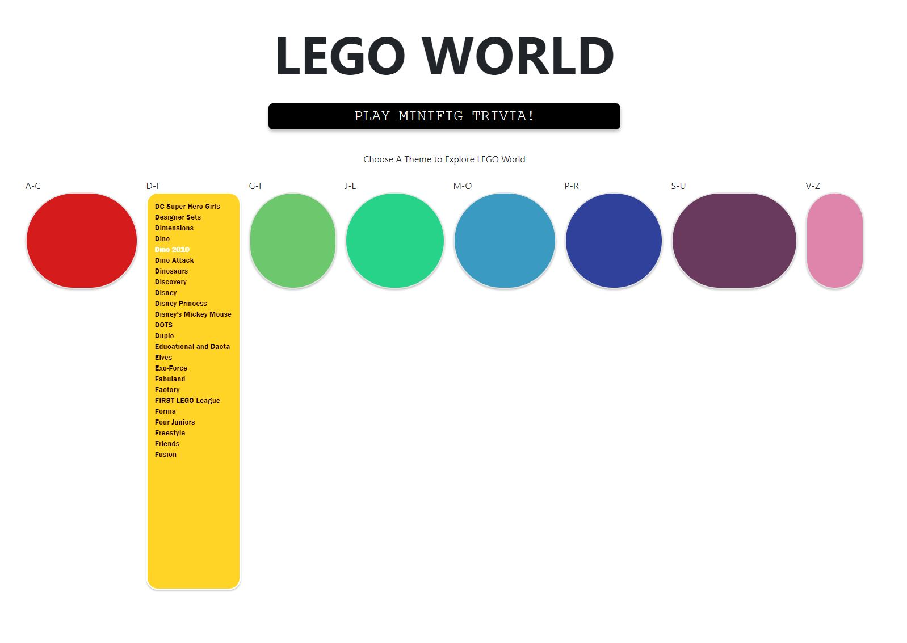
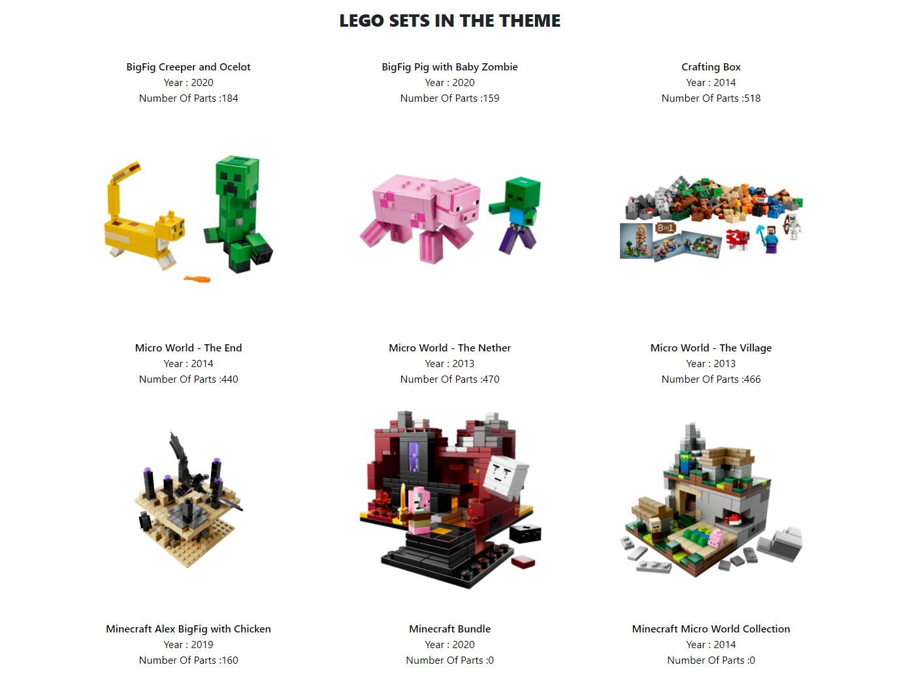
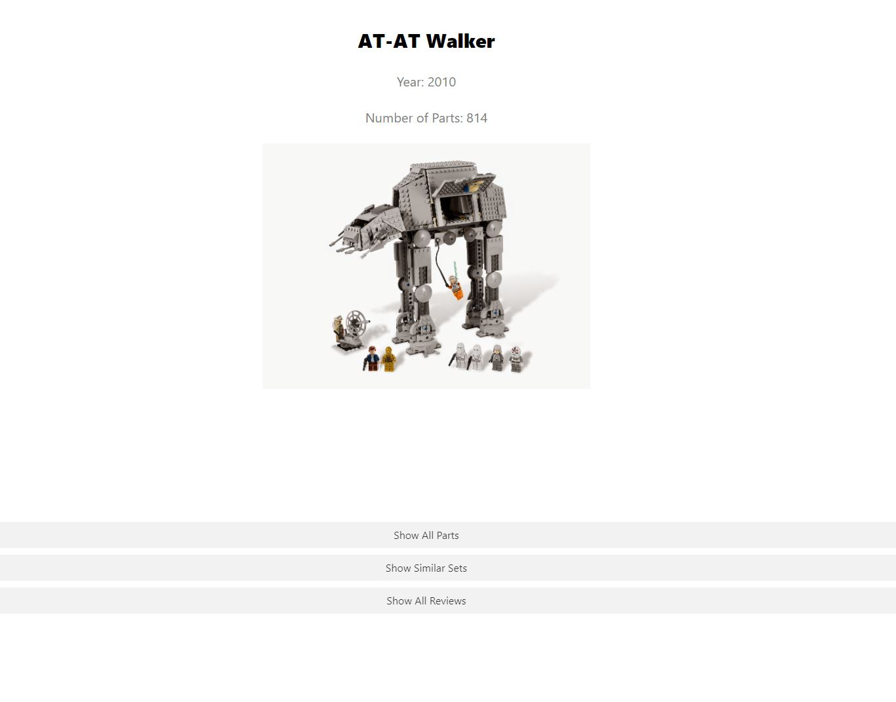
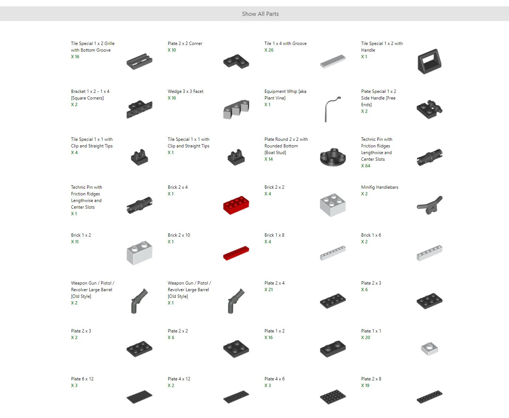
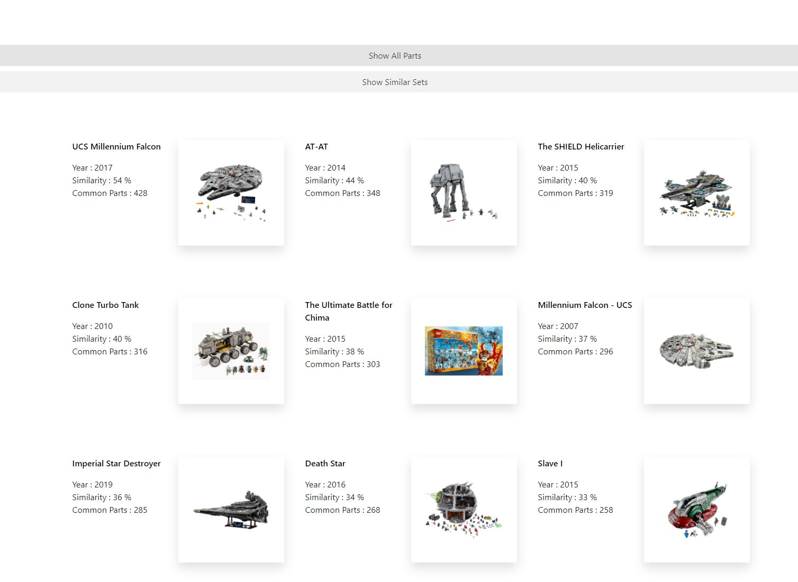
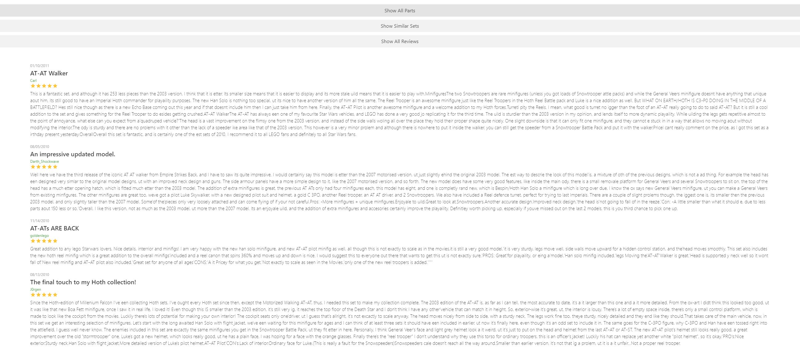
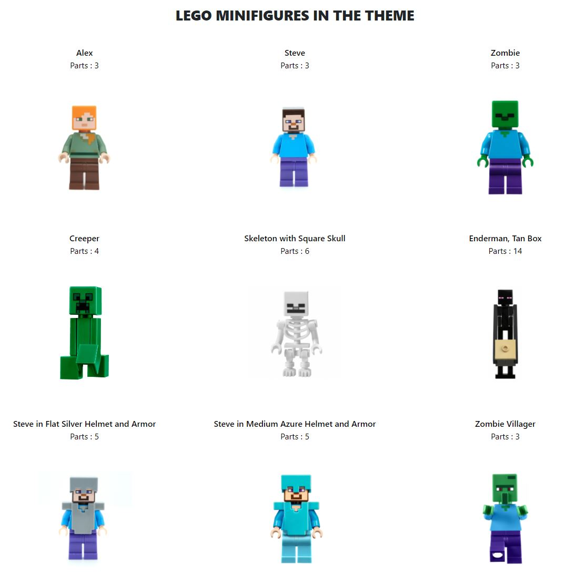
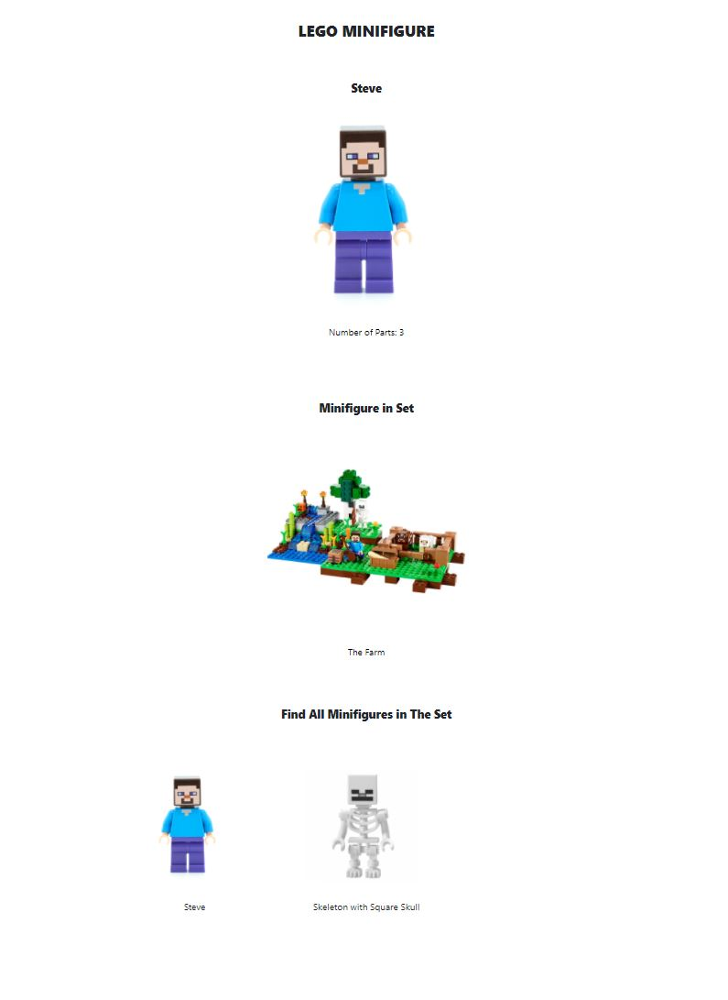
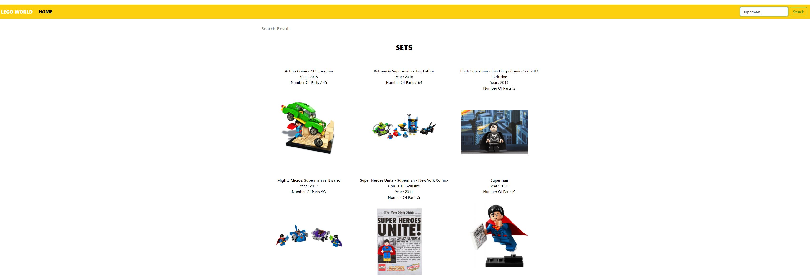
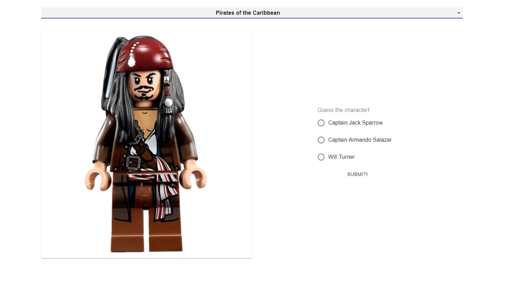

# LegoWorld

## Features
List of features ready 
* Display all themes in LEGO
* Search LEGO set/mini-figures through theme
* Display LEGO set information, building module, similar sets/ user reviews
* Display mini-figures information and other minifigures in same set
* Guess LEGO mini-figures characters and movie actors

## Example

### MAIN PAGE (Display all themes in LEGO)

### SETS PAGE (Display all sets in current LEGO theme)

### SET PAGE (Display selected set in LEGO)

### SET PAGE/BUILDING PARTS (Display all building parts in current set)

### SET PAGE/SIMILAR SETS (Display similar sets)

### SET PAGE/USER REVIEWS (Display user reviews of current set)

### MINI FIGURES PAGE (Display all mini figures in current LEGO theme)

### MINI FIGURE PAGE/ (Display selected mini figures)

### SEARCH PAGE/ (Search set or mini figure by key words)

### TRIVIAL GAME PAGE/ (Select a theme and guess the character!)

